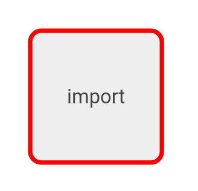
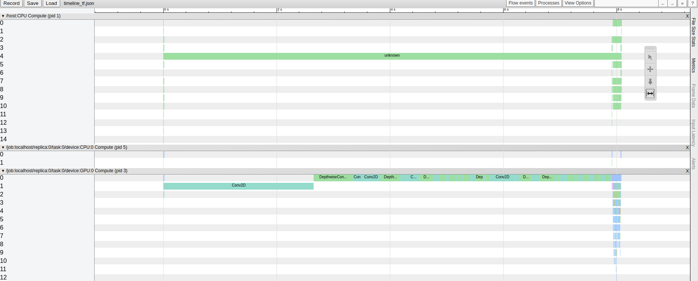

TensorFlow-TensorRT on Jetson Xavier
====

Provided Following Notebook

- TensorFlow2.0-TensorRT

## Environments

- Jetson Xavier
- JEtPack 4.4

## Description

Notebook based on Japanese

- TensorFlow-TensorRT
 - TensorFlow-TensorRT apply to Object Detection
  - TensorFlow-TensorRT FP32
  - TensorFlow-TensorRT FP16
  - TensorFlow-TensorRT INT8
  - TensorFlow-TensorRT optimize graph

## Performance

Improve rate(1 batch non/IO)

- TensorRT FP32: 1.07
- TensorRT FP16: 1.13
- TensorRT INT8: 1.16

## Demo

TensorFlow-TensorRT apply

### Before TensorFlow-TensorRT




### After TensorFlow-TensorRT


### Before Time line



### After Time Line(TensorFlow-TensorRT INT8)


## Requirement

## tensorflow install

You have to check following link

[TensorFlow on Jetson Platform](https://docs.nvidia.com/deeplearning/frameworks/install-tf-jetson-platform/index.html)

## jupyter lab install

```
sudo apt install nodejs npm
sudo apt install python3-pip
sudo pip3 install jupyter jupyterlab
sudo jupyter labextension install @jupyter-widgets/jupyterlab-manager
```

### Jtop install

```
sudo -H pip3 install jetson-stats
```

### Jupyter setting

```
sudo apt install -y nodejs npm
sudo pip3 install jupyterlab==1.0.4
```

## Usage

```
chromium-browser --disable-gpu
jupyter-lab
```

## Reference

- [TensorFlow-TensorRT](https://docs.nvidia.com/deeplearning/frameworks/tf-trt-user-guide/index.html)
- [TensorFlow-TensorRT GTC](https://developer.nvidia.com/gtc/2019/video/S9431)

## Licence

[MIT](https://github.com/tcnksm/tool/blob/master/LICENCE)

## Author

[SnowMasaya](https://github.com/SnowMasaya)